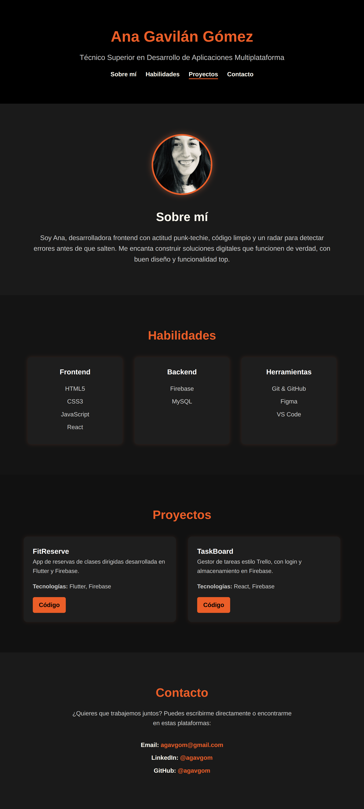

# 👩‍💻 Portfolio Web - Ana Gavilán Gómez

Este es mi portfolio personal desarrollado completamente desde cero con HTML, CSS y JavaScript. Representa mi perfil profesional como desarrolladora frontend con conocimientos full stack, actitud punk-techie y enfoque en construir soluciones útiles, bien diseñadas y funcionales.

---

## 🚀 Demo

📍 **Enlace en producción:** _Próximamente en Netlify_  
📸 *Captura real:*  


---

## 🧠 Funcionalidades

- Menú fijo con scroll suave y navegación por anclas
- Imagen personal y bio introductoria
- Skills por categoría: frontend, backend y herramientas
- Tarjetas de proyectos con tecnologías y enlaces
- Sección de contacto directo con enlaces destacados
- Diseño responsive para móviles, tablets y escritorio
- Organización modular de archivos
- Flujo Git profesional (`main`, `develop`, `feature/*`)

---

## 🧩 Estructura

ani-portfolio/
├── index.html
├── style.css
├── script.js
├── assets/
│ └── img/
│ └── captura-portfolio.png
├── drafts/
├── .gitignore
└── README.md


---

## 🛠️ Tecnologías

- HTML5
- CSS3 (Flexbox, Grid, variables, media queries)
- JavaScript (vanilla)
- Git y GitHub (SSH, ramas, issues, board)
- Netlify (despliegue)
- VS Code + extensiones

---

## 🧪 Flujo de trabajo Git

- `main`: rama de producción
- `develop`: rama de integración continua
- `feature/*`: ramas independientes por funcionalidad

---

## 🗂️ Gestión del proyecto

- GitHub Issues para cada funcionalidad
- GitHub Projects (Kanban) con columnas:
  - 💡 Ideas
  - 🔧 To Do
  - 🚧 In Progress
  - ✅ Done
  - 🧪 Testing
- Documentación de cada tarea en `/drafts`

---

## 📦 Instalación local

```
git clone git@github.com:agavgom/ani-portfolio.git
cd ani-portfolio
git checkout develop
code .
```

---

## 🌍 Despliegue en Netlify

1. Conectar Netlify con tu cuenta de GitHub
2. Seleccionar el repo ani-portfolio
3. Configurar rama de despliegue como main
4. ¡Publicar!

---

## 🙋‍♀️ Sobre mí

Soy Ana Gavilán, Técnico Superior en desarrollo de aplicaciones multiplataforma y desarrolladora frontend con una visión clara: código limpio, soluciones útiles y aprendizaje constante. Me encanta combinar tecnología, diseño y actitud para construir cosas que aporten valor.

---

## 📬 Contacto

✉️ Email: agavgom@gmail.com

💼 LinkedIn: [@agavgom](https://www.linkedin.com/in/aniiigo/)

🐙 GitHub: [@agavgom](https://github.com/agavgom)

---

## 🧾 Licencia

MIT © 2025 Ana Gavilán Gómez
=======
# 👩‍💻 Portfolio de Ana Gavilán Gómez

Bienvenida a mi portfolio web, desarrollado desde cero con HTML, CSS y JavaScript. Este proyecto es una muestra de mis habilidades como desarrolladora Full Stack, con enfoque en código limpio, diseño responsive y flujo de trabajo profesional con Git y GitHub.

---

## 🧠 Tecnologías utilizadas

- **HTML5** – Estructura semántica y accesible
- **CSS3** – Diseño visual con estilos custom, media queries y variables
- **JavaScript (Vanilla)** – Interacciones y mejoras UX
- **Git & GitHub** – Control de versiones con flujo profesional
- **GitHub Projects** – Organización de tareas y fases del proyecto
- **Netlify** – Despliegue continuo desde `main`

---

## 🗂️ Estructura del proyecto
```
ani-portfolio/
├── index.html # Página principal
├── style.css # Estilos globales
├── script.js # Interacción básica
├── assets/
│ ├── img/ # Imágenes (foto, proyectos, etc.)
│ ├── icons/ # Iconos SVG o PNG
│ └── fonts/ # Fuentes personalizadas (opcional)
├── drafts/ # Documentación técnica interna (Markdown)
├── .gitignore
└── README.md
```


---

## 🧩 Organización del trabajo

Este proyecto sigue una estructura de ramas profesional:

- `main`: rama estable para producción (despliegue en Netlify)
- `develop`: rama de integración
- `feature/nombre`: ramas independientes por funcionalidad

Además, se utiliza un **Project Board estilo Kanban** para planificar tareas en curso y completadas.

---

## 🛠️ Cómo usar este proyecto en local

1. Clonar el repositorio (por SSH):
   ```
   git clone git@github.com:agavgom/ani-portfolio.git
   cd ani-portfolio
  	```
2. Cambiar a la rama de desarrollo:
  ```
  git checkout develop
  ```

3. Abrir en tu editor favorito (VS Code recomendado):
```
code .
```

4. Puedes abrir `index.html` directamente en el navegador para probar.

---

# 🚀 Despliegue
Este proyecto se despliega con Netlify a partir de la rama main.
URL del proyecto: https://ani-portfolio.netlify.app (personaliza según tu dominio)

---

# 💬 Contacto
Email: agavgom@gmail.com
LinkedIn: [@aniiigo](https://www.linkedin.com/in/aniiigo)
GitHub: [@agavgom](https://github.com/agavgom)
---

# 📄 Licencia
Este proyecto está licenciado bajo la MIT License.


